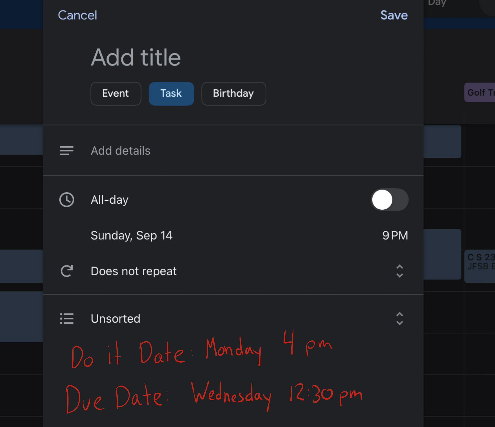
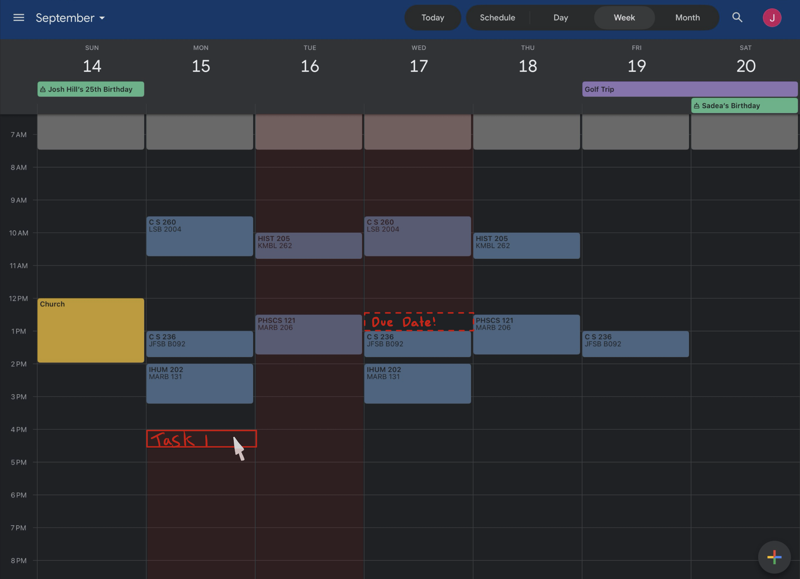

# Healthy Calandar

[My Notes](notes.md)

## 🚀 Specification Deliverable

> [!NOTE]
>  Fill in this sections as the submission artifact for this deliverable. You can refer to this [example](https://github.com/webprogramming260/startup-example/blob/main/README.md) for inspiration.

For this deliverable I did the following. I checked the box `[x]` and added a description for things I completed.

- [ ] Proper use of Markdown
- [ ] A concise and compelling elevator pitch
- [ ] Description of key features
- [ ] Description of how you will use each technology
- [ ] One or more rough sketches of your application. Images must be embedded in this file using Markdown image references.

### Elevator pitch

Very early in my life I was diagnosed with clinical OCD. Because of this, I do many things differently than 'normal' people. One of those things I am very particular about, is my calandar. I live and breathe by my calandar. But sometimes, my calandar controls me more than I control it. What if there was a calandar designed from the ground up, with mental health in mind? I think many of us, even those without mental health struggles, could benefit from a calandar focused on maintaining a healthy state of mind.

This calandar would recognize when you are overburdening yourself. It could recognize unsustainable 'bursts' of productivity and help you balance it with a healthy, sustainable growth pattern. Conversly, it could help you understand when you are being 'lazy' or too unproductive, and help encourage you to do more and be better. All of this, without compromising critical functionality of other calendar apps. 

### Design

### Key features

- Secure login over HTTPS
- Basic Calandar Functionality
- 'Do It' dates and 'Due Dates'
- Prompts that tell you when you are overexerting
- Prompts that tell you when you are underexerting

### Technologies

I am going to use the required technologies in the following ways.

- **HTML** - Structure the webpage and organize the calandar
- **CSS** - Beautify the calandar
- **React** - Due it Dates dynamically showing time remaining, Login service
- **Service** - Backend storage of calandared items
- **DB/Login** - User Storage
- **WebSocket** - Unclear how I am going to implement this for the class. I want to set up a way where you can share calandars with friends, but if that proves too much i will likely implement a texting feature

## 🚀 AWS deliverable

For this deliverable I did the following. I checked the box `[x]` and added a description for things I completed.

- [ ] **Server deployed and accessible with custom domain name** - [My server link](https://yourdomainnamehere.click).

## 🚀 HTML deliverable

## HTML deliverable

For this deliverable I built out the structure of my application using HTML.

- [x] **HTML pages** - Several HTML pages, but the main ones being Active Games, and the landing page.
- [x] **Links** - There is a return home link on each page, and the landing page allows linking to each of the relevent pages
- [x] **Text** - Each of the relevent technologies are represented with a short description.
- [x] **Images** - There is a logo provided in the navbar (The symbol for the god 'Guthix' in runescape)
- [x] **DB/Login** - Placeholder for register and login provided.
- [x] **WebSocket** - Placeholder for websockets provided on active games page

- [x] **Proper HTML element usage** - I have a header, nav, and body. all relevent HTML elements are used
- [x] **3rd party API placeholder** - Placeholder on Active games page.
- [x] **DB data placeholder** - Placeholder under Active Games page.

## 🚀 CSS deliverable

For this deliverable I did the following. I checked the box `[x]` and added a description for things I completed.

- [x] **Header, footer, and main content body** - I forgot my footer last deliverable so I added it, and styled the header, footer and content.
- [x] **Navigation elements** - This is where I spent the most of my time, because this is what I dont expect to change much. The other stylings I expect I will alter after we go over react.
- [x] **Responsive to window resizing** - Also the most reponsive part of my page thus far is the navbar. but I admit I am big proud of it. 
- [x] **Application elements** - I styled what I could, but almost everything here will need to be done in react.
- [x] **Application images** - My page is not going to be image heavy, but the image that I do have is responsive as it is in the navbar

## 🚀 React part 1: Routing deliverable

For this deliverable I did the following. I checked the box `[x]` and added a description for things I completed.

- [ ] **Bundled using Vite** - I did not complete this part of the deliverable.
- [ ] **Components** - I did not complete this part of the deliverable.
- [ ] **Router** - I did not complete this part of the deliverable.

## 🚀 React part 2: Reactivity deliverable

For this deliverable I did the following. I checked the box `[x]` and added a description for things I completed.

- [ ] **All functionality implemented or mocked out** - I did not complete this part of the deliverable.
- [ ] **Hooks** - I did not complete this part of the deliverable.

## 🚀 Service deliverable

For this deliverable I did the following. I checked the box `[x]` and added a description for things I completed.

- [ ] **Node.js/Express HTTP service** - I did not complete this part of the deliverable.
- [ ] **Static middleware for frontend** - I did not complete this part of the deliverable.
- [ ] **Calls to third party endpoints** - I did not complete this part of the deliverable.
- [ ] **Backend service endpoints** - I did not complete this part of the deliverable.
- [ ] **Frontend calls service endpoints** - I did not complete this part of the deliverable.
- [ ] **Supports registration, login, logout, and restricted endpoint** - I did not complete this part of the deliverable.

## 🚀 DB deliverable

For this deliverable I did the following. I checked the box `[x]` and added a description for things I completed.

- [ ] **Stores data in MongoDB** - I did not complete this part of the deliverable.
- [ ] **Stores credentials in MongoDB** - I did not complete this part of the deliverable.

## 🚀 WebSocket deliverable

For this deliverable I did the following. I checked the box `[x]` and added a description for things I completed.

- [ ] **Backend listens for WebSocket connection** - I did not complete this part of the deliverable.
- [ ] **Frontend makes WebSocket connection** - I did not complete this part of the deliverable.
- [ ] **Data sent over WebSocket connection** - I did not complete this part of the deliverable.
- [ ] **WebSocket data displayed** - I did not complete this part of the deliverable.
- [ ] **Application is fully functional** - I did not complete this part of the deliverable.

Change for the homework assaingment.
